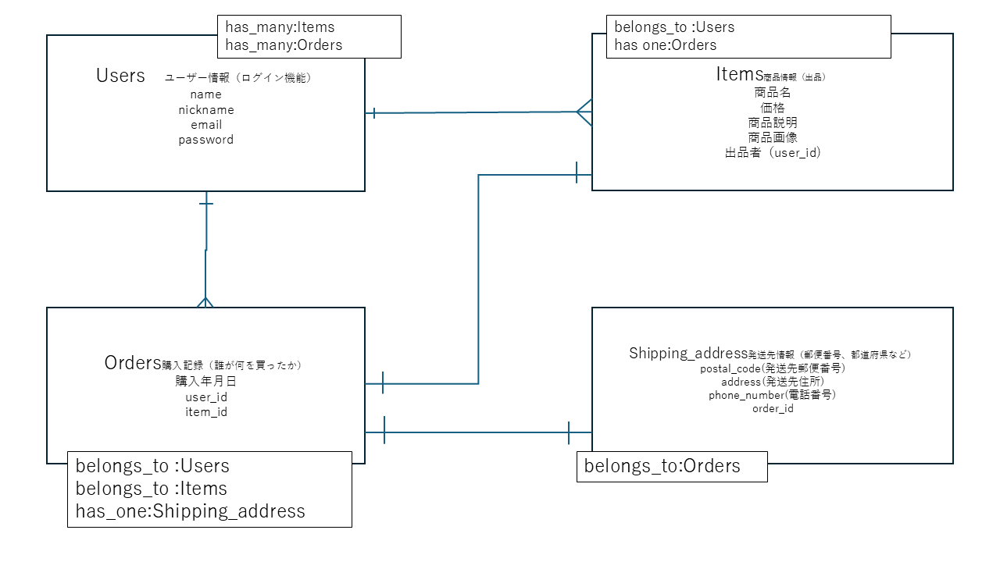

# FURIMA

## ER図

## users テーブル

| Column   | Type   | Options     |
| -------- | ------ | ----------- |
| name     | string | null: false |
| nickname | string | null: false |
| email    | string | null: false, unique: true |
| password | string | null: false |

### Association
- has_many :items
- has_many :orders

## items テーブル

| Column      | Type       | Options                        |
| ----------- | ---------- | ------------------------------ |
| name        | string     | null: false |
| price       | integer    | null: false |
| description | text       | null: false |
| user_id     | references | null: false, foreign_key: true |

### Association
- belongs_to :user
- has_one :order

## orders テーブル

| Column  | Type       | Options                        |
| ------- | ---------- | ------------------------------ |
| user_id | references | null: false, foreign_key: true |
| item_id | references | null: false, foreign_key: true |

### Association
- belongs_to :user
- belongs_to :item
- has_one :shipping_address

## shipping_addresses テーブル

| Column       | Type       | Options                        |
| ------------ | ---------- | ------------------------------ |
| postal_code  | string     | null: false |
| address      | string     | null: false |
| phone_number | string     | null: false |
| order_id     | references | null: false, foreign_key: true |

### Association
- belongs_to :order